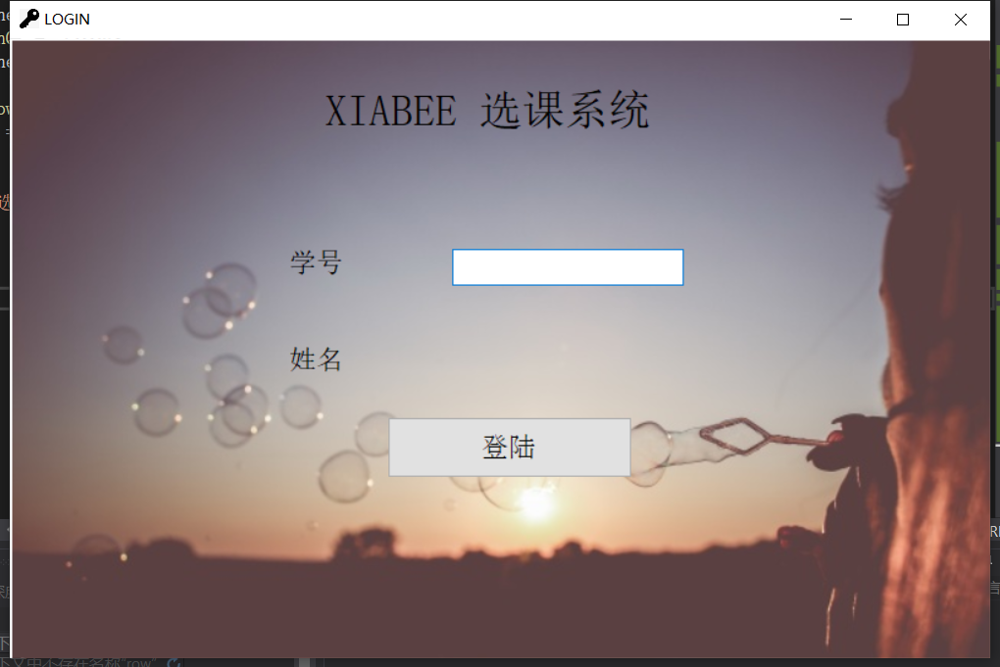
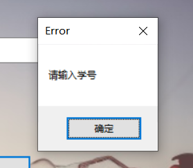
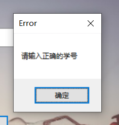
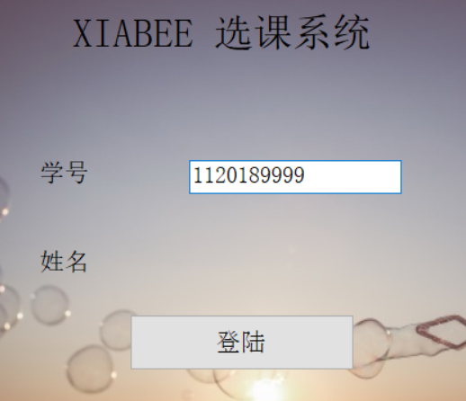
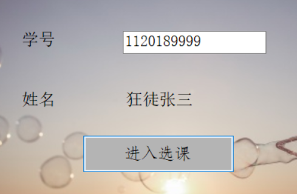
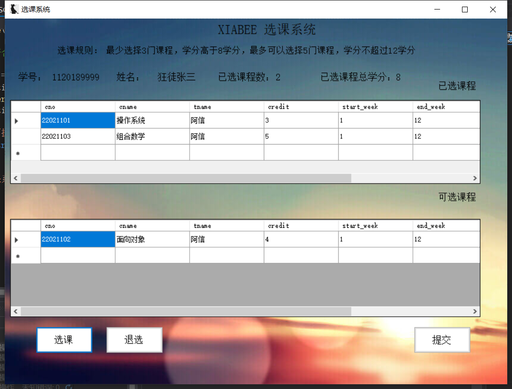
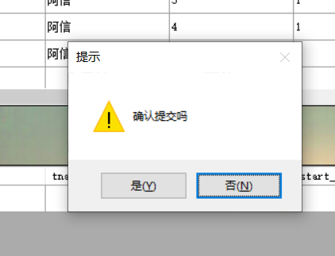
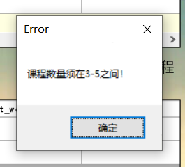
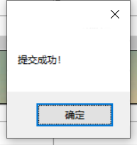
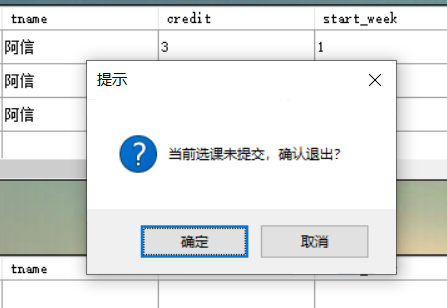

# Course-Selection-System

#### 简介

一个很菜很菜的选课管理系统模板

| 项目       | 内容                   |
| ---------- | ---------------------- |
| 数据库环境 | SQL Server 2019        |
| 编译环境   | Visual Studio 2019 Pro |
| 框架版本   | .NET  Framework 4.7.2  |
| 语言实现   | C#                     |
| 主要功能   | 实现用户登陆、选课管理 |
| 主界面     | Form_SCT               |
| 项目名称   | SCSystem               |


#### 目录架构

```
├── README.md
├── SCSystem
│   ├── App.config
│   ├── DataSet_SC.Designer.cs
│   ├── DataSet_SC.xsc
│   ├── DataSet_SC.xsd
│   ├── DataSet_SC.xss
│   ├── DataSet_kexuan.Designer.cs
│   ├── DataSet_kexuan.xsc
│   ├── DataSet_kexuan.xsd
│   ├── DataSet_kexuan.xss
│   ├── DataSet_yixuan.Designer.cs
│   ├── DataSet_yixuan.xsc
│   ├── DataSet_yixuan.xsd
│   ├── DataSet_yixuan.xss
│   ├── Form_SCT.Designer.cs
│   ├── Form_SCT.cs
│   ├── Form_SCT.resx
│   ├── Form_login.Designer.cs
│   ├── Form_login.cs
│   ├── Form_login.resx
│   ├── Program.cs
│   ├── Properties
│   │   ├── AssemblyInfo.cs
│   │   ├── Resources.Designer.cs
│   │   ├── Resources.resx
│   │   ├── Settings.Designer.cs
│   │   └── Settings.settings
│   ├── SCSystem.csproj
│   ├── SCSystem.sln
│   ├── bin
│   │   ├── Debug
│   │   │   ├── SCSystem.exe
│   │   │   ├── SCSystem.exe.config
│   │   │   └── SCSystem.pdb
│   │   └── Release
│   ├── img
│   │   ├── back1.jpg
│   │   ├── back2.jpg
│   │   ├── fav.ico
│   │   └── favicon.ico
│   └── obj
│       └── Debug
│           ├── DesignTimeResolveAssemblyReferences.cache
│           ├── DesignTimeResolveAssemblyReferencesInput.cache
│           ├── SCSystem.Form_SCT.resources
│           ├── SCSystem.Form_login.resources
│           ├── SCSystem.Properties.Resources.resources
│           ├── SCSystem.csproj.CoreCompileInputs.cache
│           ├── SCSystem.csproj.FileListAbsolute.txt
│           ├── SCSystem.csproj.GenerateResource.cache
│           ├── SCSystem.csprojAssemblyReference.cache
│           ├── SCSystem.exe
│           ├── SCSystem.pdb
│           └── TempPE
│               ├── DataSet_SC.Designer.cs.dll
│               ├── DataSet_kexuan.Designer.cs.dll
│               ├── DataSet_weixuan.Designer.cs.dll
│               └── DataSet_yixuan.Designer.cs.dll
└── init.sql

9 directories, 51 files
```


#### 配置方式

* 通过`SQL Server`打开并执行`init.sql`，创建相应数据库，建立相应表单
* 通过`Visual Studio`打开项目文件`SCSystem/SCSystem.sln`，在VS右侧窗格中找到`解决资源方案管理器`，自行修改`Form_login.cs`与`Form_SCT.cs`内核代码
* 同上修改相应适配器和数据集


#### 注意：

* 尽量不要手动修改`*.xsd`和`*.resx`......配置文件谨慎修改


#### 功能举例



######  输入空学号

* 弹窗报错

  


###### 输入错误学号

* 弹窗报错

  


###### 输入正确学号

* 显示姓名，**“登陆”**按钮变为**“进入选课”**







---

##### 选课

* 显示已选课程和可选课程，在选择可选课程后，自动添加至“已选课程”中，并删除对应“可选课程”

  


###### 临时保存

* 在修改选课内容（包括选课和退选）后，系统将把当前修改内容存入临时表单中，并在左上角标志处显示 "*" ，表明未提交

  


###### 提交检测

* 点击提交按钮时，会提示是否确认，并检测选课内容是否符合选课规则：符合则完成提交并弹窗提示；不符合则终止提交并弹窗提示，返回选课界面









###### 关闭检测

* 在系统处于”未提交“状态时关闭系统，会弹窗提示



